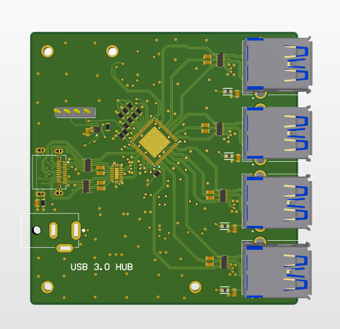
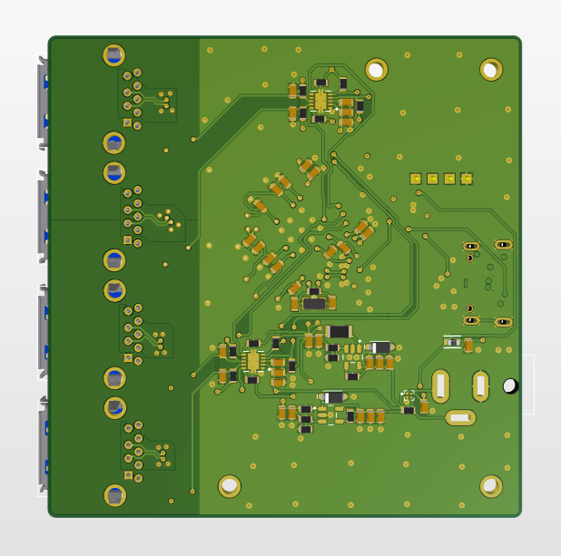

# USB 3.0 Hub Design with TUSB8041

## Disclaimer
This design was created for educational purposes. While the provided files and documentation outline the design, **it may not be fully functional or suitable for production without further validation and refinements**.

## Overview
This project features a custom-designed USB 3.0 hub based on the TUSB8041 chip from Texas Instruments. The hub is a 4-to-1 design, allowing four downstream devices to connect via USB 3.0. Key features include:

* **Input (Upstream) Connector**: A USB-C port powered by the TUSB320RWBR for USB Type-C configuration handling.
* **Downstream Ports**: Four USB 3.0 downstream ports for high-speed device connectivity.
* **Power Supply**: An external DC jack ensures sufficient power delivery for connected devices.

The project includes schematics, PCB layout files, and design documentation, demonstrating the integration of USB-C functionality, power management, and high-speed data communication.

  

  

## Documentation

For more details, you can view the schematic and PCB layout in the exported PDF:  
[View Altium Design (PDF)](UsbHub.pdf)
